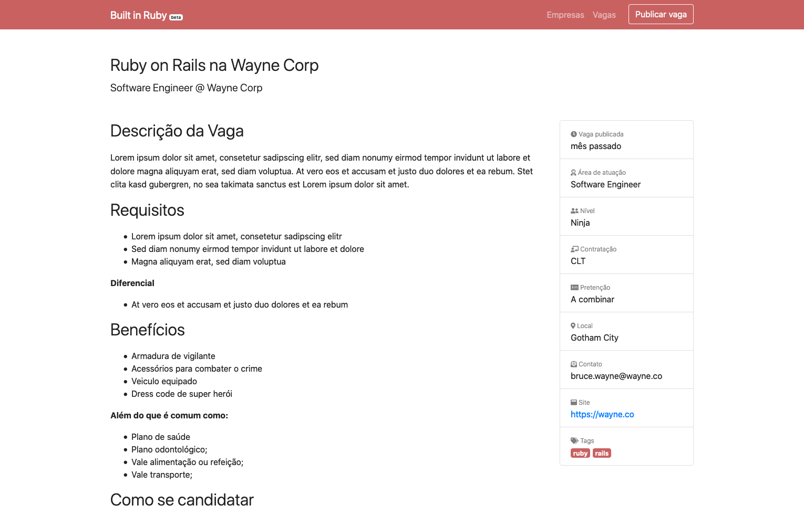

## Sobre o Projeto

Built in Ruby é um site criado pela comunidade e para a comunidade como uma tentativa de manter um ponto mais central de divulgação de vagas e empresas que trabalham com a linguagem Ruby e tecnologias relacionadas.

## Licença

[MIT](./LICENSE)
